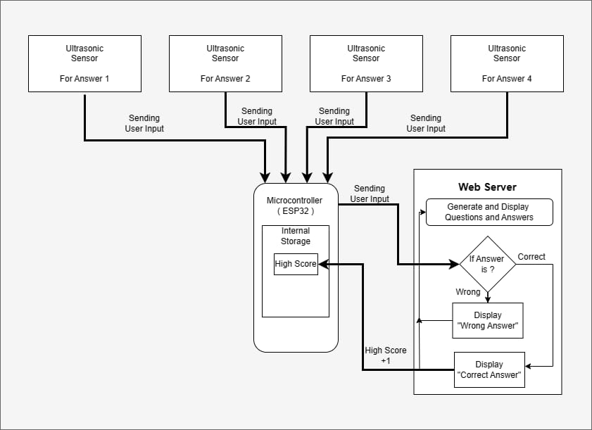

# EduSense 

## 1. Introduction
EduSense, is an innovative touchless educational tool designed to help children with 
disabilities interact with educational content using hand gestures. The system utilizes 
ultrasonic sensors connected to an ESP32 microcontroller to detect hand movements, 
allowing users to answer questions by moving their hands. The tool is supported by a 
web interface, hosted on the ESP32, where questions and answers are displayed.

## 2. System Architecture

Using 4 ultrasonic sensors, the user gives input. The input is sent to the web server 
to check if the answer is correct. If correct, display the correct message and add 1 
to the score. If wrong, show the wrong message. If the current score exceeds the 
high score, update the high score to match the current score

